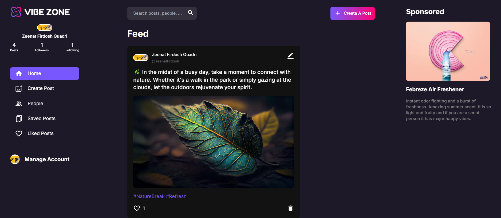
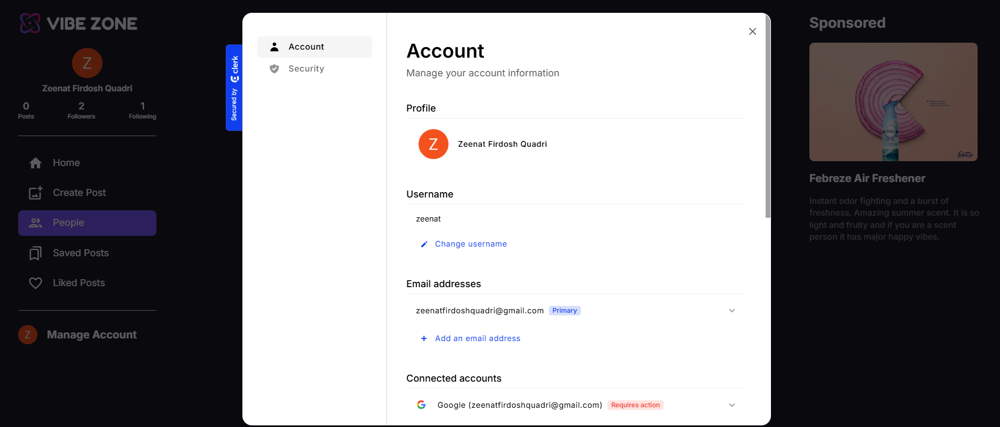
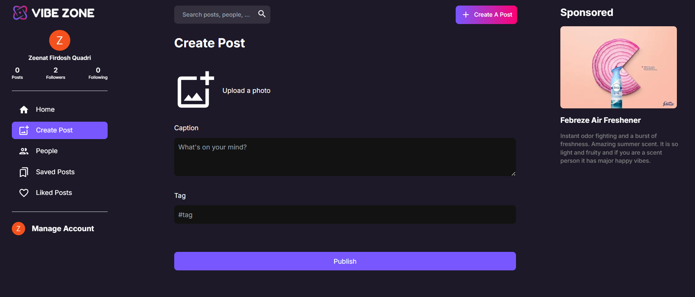
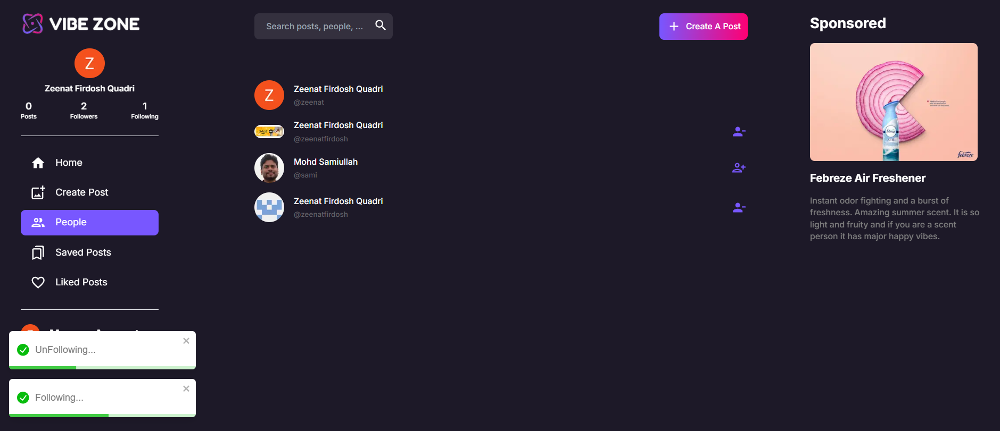
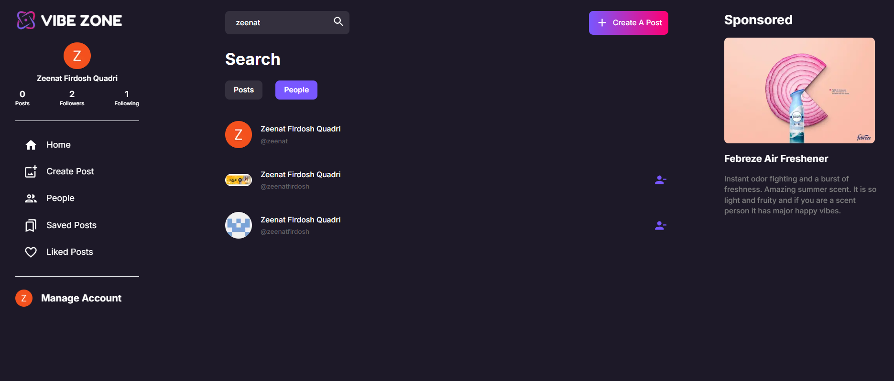

# Social Media (NEXT.Js)

## Deployed Link: https://social-media-app-next-nine.vercel.app/

## Description

This is a social media application built using Next.js and Tailwind CSS. Users can create accounts, post updates, like and comment on posts, and follow other users.

## Features

- User registration and authentication using Clerk.
- Create, read, update, and delete posts.
- Like and comment on posts.
- Follow and unfollow other users.
- Search for users.
- Display a user's profile with their posts, followers, and following.

## Screenshots

Home page:



User profile:



Post Create page:



People Page:



Search Page:



## Tech Stack

- Next.js: A React framework for building server-rendered applications.
- Tailwind CSS: A utility-first CSS framework for building responsive designs.
- MongoDB: For storing user data and posts.
- Mongoose: A MongoDB object modeling tool for Node.js.
- Axios: For making API requests.
- React-hook-form: For creating custom form elements.
- React-toastify: For displaying notifications.
- Clerk: For authenticating users.

## How to run this project locally

To run this project locally, you need to have Node.js and npm (or yarn or pnpm) installed on your machine.
* Clone the repository.
* Install the dependencies.

## Getting Started

First, run the development server:

```bash
npm run dev
# or
yarn dev
# or
pnpm dev
# or
bun dev
```

Open [http://localhost:3000](http://localhost:3000) with your browser to see the result.


## Deploy on Vercel

The easiest way to deploy your Next.js app is to use the [Vercel Platform](https://vercel.com/new?utm_medium=default-template&filter=next.js&utm_source=create-next-app&utm_campaign=create-next-app-readme) from the creators of Next.js.

Check out our [Next.js deployment documentation](https://nextjs.org/docs/deployment) for more details.
